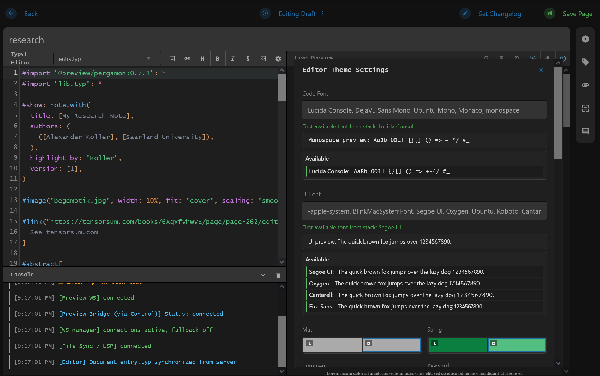

# font-probe

Browser font probing utility that uses canvas typography signatures to estimate whether a requested font is actually rendering.

## Why font-probe?

The idea of truly "web-safe" fonts is much less reliable today than it used to be, the same font stack can resolve differently across clients. A practical use case is an online editor where users pick a font in settings: the selected name may exist in the list, but it might still fall back to another font on a specific device. JavaScript alone does not clearly tell you which font from that list is actually being rendered. I could not find an existing package focused on reliably answering that question in the browser, so I built tiny `font-probe` to surface the fonts that are really rendering for each client.



## Install

```bash
npm install font-probe
```

## Usage

```ts
import { FontProbe } from "font-probe";

const stack = 'Inter, "Segoe UI", Arial, sans-serif';
const candidates = FontProbe.splitFontFamilyList(stack);

for (const name of candidates) {
  const signal = FontProbe.getFontDistinctSignal(name);
  console.log(name, signal.label);
}
```

### Browser usage (no TypeScript)

```html
<script src="https://unpkg.com/font-probe/dist/font-probe.min.js"></script>
<script>
  const signal = window.FontProbeLib.FontProbe.getFontDistinctSignal("Arial");
  console.log(signal.label);
</script>
```

Standalone example file: `examples/cdn-demo.html`

Possible labels:

- `available`
- `generic`
- `not rendering`
- `not found`

## Demo

[https://dodotree.github.io/font-probe/](https://dodotree.github.io/font-probe/)

How to use:

1. Enter a comma-separated list of font names in the text area.
2. Click **Probe Fonts**.
3. Check **available** (with samples) and **others** (`generic`, `not rendering`, `not found`).

## Ready example

```bash
npm run example
```

Then open the URL printed by `http-server` (usually `http://127.0.0.1:8080`) and use `index.html`.

Do not open `index.html` directly with `file://` from desktop: browsers block module loading there and you'll see CORS/module errors.

If using VS Code Live Server:

1. Run `npm run build` first (so `dist/` exists).
2. Start Live Server from the project root.
3. Open `/index.html` via `http://127.0.0.1:<port>/index.html`.

The example page:

- accepts a comma-separated list of font names,
- applies that full list to preview text,
- probes every candidate with `FontProbe`,
- groups output into `available` (with text samples) and `others` (`generic`, `not rendering`, `not found`).
